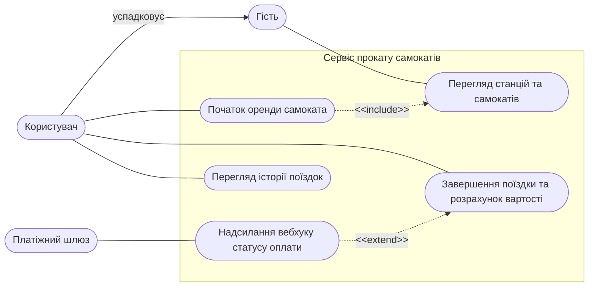

### Use Case діаграма — Сервіс прокату самокатів

```mermaid
flowchart LR
    Guest(["Гість"])
    User(["Користувач"])
    PaymentGateway(["Платіжний шлюз"])

    User -->|успадковує| Guest

    subgraph System ["Сервіс прокату самокатів"]
        direction TB
        UC1(["Перегляд станцій та самокатів"])
        UC2(["Початок оренди самоката"])
        UC3(["Завершення поїздки та розрахунок вартості"])
        UC4(["Надсилання вебхуку статусу оплати"])
        UC5(["Перегляд історії поїздок"])
    end

    Guest --- UC1
    User --- UC2
    User --- UC3
    User --- UC5
    PaymentGateway --- UC4

    UC2 -.->|"&lt;&lt;include&gt;&gt;"| UC1
    UC4 -.->|"&lt;&lt;extend&gt;&gt;"| UC3
```