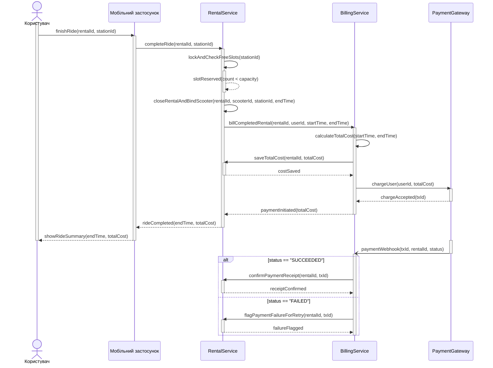

### Діаграма 1 — Успішне завершення поїздки на вільній станції

```mermaid
sequenceDiagram
    actor User as Користувач
    participant UI as Мобільний застосунок
    participant Rental as RentalService
    participant Billing as BillingService
    participant Gateway as PaymentGateway

    activate User
    User->>UI: finishRide(rentalId, stationId)
    activate UI
    UI->>Rental: completeRide(rentalId, stationId)
    activate Rental
    Rental->>Rental: lockAndCheckFreeSlots(stationId)
    activate Rental
    Rental-->>Rental: slotReserved(count < capacity)
    deactivate Rental
    Rental->>Rental: closeRentalAndBindScooter(rentalId, scooterId, stationId, endTime)
    Rental->>Billing: billCompletedRental(rentalId, userId, startTime, endTime)
    activate Billing
    Billing->>Billing: calculateTotalCost(startTime, endTime)
    Billing->>Rental: saveTotalCost(rentalId, totalCost)
    activate Rental
    Rental-->>Billing: costSaved
    deactivate Rental
    Billing->>Gateway: chargeUser(userId, totalCost)
    activate Gateway
    Gateway-->>Billing: chargeAccepted(txId)
    deactivate Gateway
    Billing-->>Rental: paymentInitiated(totalCost)
    deactivate Billing
    Rental-->>UI: rideCompleted(endTime, totalCost)
    deactivate Rental
    UI-->>User: showRideSummary(endTime, totalCost)
    deactivate UI
    deactivate User

    activate Gateway
    Gateway-)Billing: paymentWebhook(txId, rentalId, status)
    deactivate Gateway
    activate Billing
    alt status == "SUCCEEDED"
        Billing->>Rental: confirmPaymentReceipt(rentalId, txId)
        activate Rental
        Rental-->>Billing: receiptConfirmed
        deactivate Rental
    else status == "FAILED"
        Billing->>Rental: flagPaymentFailureForRetry(rentalId, txId)
        activate Rental
        Rental-->>Billing: failureFlagged
        deactivate Rental
    end
    deactivate Billing
```