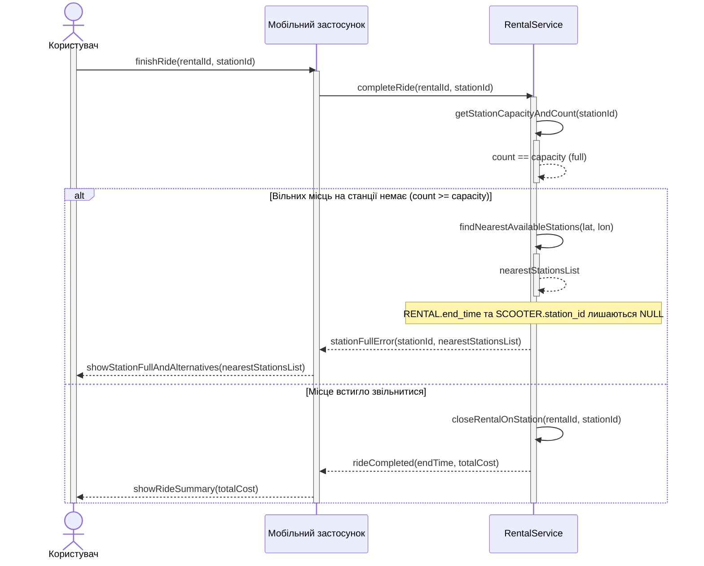

### Діаграма 2 — Спроба завершення поїздки на переповненій станції

```mermaid
sequenceDiagram
    actor User as Користувач
    participant UI as Мобільний застосунок
    participant Rental as RentalService

    activate User
    User->>UI: finishRide(rentalId, stationId)
    activate UI
    UI->>Rental: completeRide(rentalId, stationId)
    activate Rental
    Rental->>Rental: getStationCapacityAndCount(stationId)
    activate Rental
    Rental-->>Rental: count == capacity (full)
    deactivate Rental

    alt Вільних місць на станції немає (count >= capacity)
        Rental->>Rental: findNearestAvailableStations(lat, lon)
        activate Rental
        Rental-->>Rental: nearestStationsList
        deactivate Rental
        Note over Rental: RENTAL.end_time та SCOOTER.station_id лишаються NULL
        Rental-->>UI: stationFullError(stationId, nearestStationsList)
        UI-->>User: showStationFullAndAlternatives(nearestStationsList)
    else Місце встигло звільнитися
        Rental->>Rental: closeRentalOnStation(rentalId, stationId)
        Rental-->>UI: rideCompleted(endTime, totalCost)
        UI-->>User: showRideSummary(totalCost)
    end
    deactivate Rental
    deactivate UI
    deactivate User
```