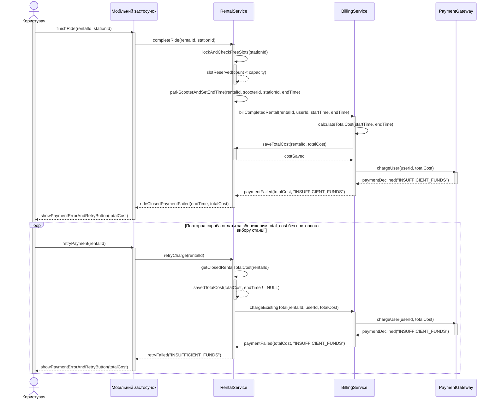

### Діаграма 3 — Помилка оплати при завершенні поїздки

```mermaid
sequenceDiagram
    actor User as Користувач
    participant UI as Мобільний застосунок
    participant Rental as RentalService
    participant Billing as BillingService
    participant Gateway as PaymentGateway

    activate User
    User->>UI: finishRide(rentalId, stationId)
    activate UI
    UI->>Rental: completeRide(rentalId, stationId)
    activate Rental
    Rental->>Rental: lockAndCheckFreeSlots(stationId)
    activate Rental
    Rental-->>Rental: slotReserved(count < capacity)
    deactivate Rental
    Rental->>Rental: parkScooterAndSetEndTime(rentalId, scooterId, stationId, endTime)
    Rental->>Billing: billCompletedRental(rentalId, userId, startTime, endTime)
    activate Billing
    Billing->>Billing: calculateTotalCost(startTime, endTime)
    Billing->>Rental: saveTotalCost(rentalId, totalCost)
    activate Rental
    Rental-->>Billing: costSaved
    deactivate Rental
    Billing->>Gateway: chargeUser(userId, totalCost)
    activate Gateway
    Gateway-->>Billing: paymentDeclined("INSUFFICIENT_FUNDS")
    deactivate Gateway
    Billing-->>Rental: paymentFailed(totalCost, "INSUFFICIENT_FUNDS")
    deactivate Billing
    Rental-->>UI: rideClosedPaymentFailed(endTime, totalCost)
    deactivate Rental
    UI-->>User: showPaymentErrorAndRetryButton(totalCost)
    deactivate UI

    loop Повторна спроба оплати за збереженим total_cost без повторного вибору станції
        User->>UI: retryPayment(rentalId)
        activate UI
        UI->>Rental: retryCharge(rentalId)
        activate Rental
        Rental->>Rental: getClosedRentalTotalCost(rentalId)
        activate Rental
        Rental-->>Rental: savedTotalCost(totalCost, endTime != NULL)
        deactivate Rental
        Rental->>Billing: chargeExistingTotal(rentalId, userId, totalCost)
        activate Billing
        Billing->>Gateway: chargeUser(userId, totalCost)
        activate Gateway
        Gateway-->>Billing: paymentDeclined("INSUFFICIENT_FUNDS")
        deactivate Gateway
        Billing-->>Rental: paymentFailed(totalCost, "INSUFFICIENT_FUNDS")
        deactivate Billing
        Rental-->>UI: retryFailed("INSUFFICIENT_FUNDS")
        deactivate Rental
        UI-->>User: showPaymentErrorAndRetryButton(totalCost)
        deactivate UI
    end
    deactivate User
```