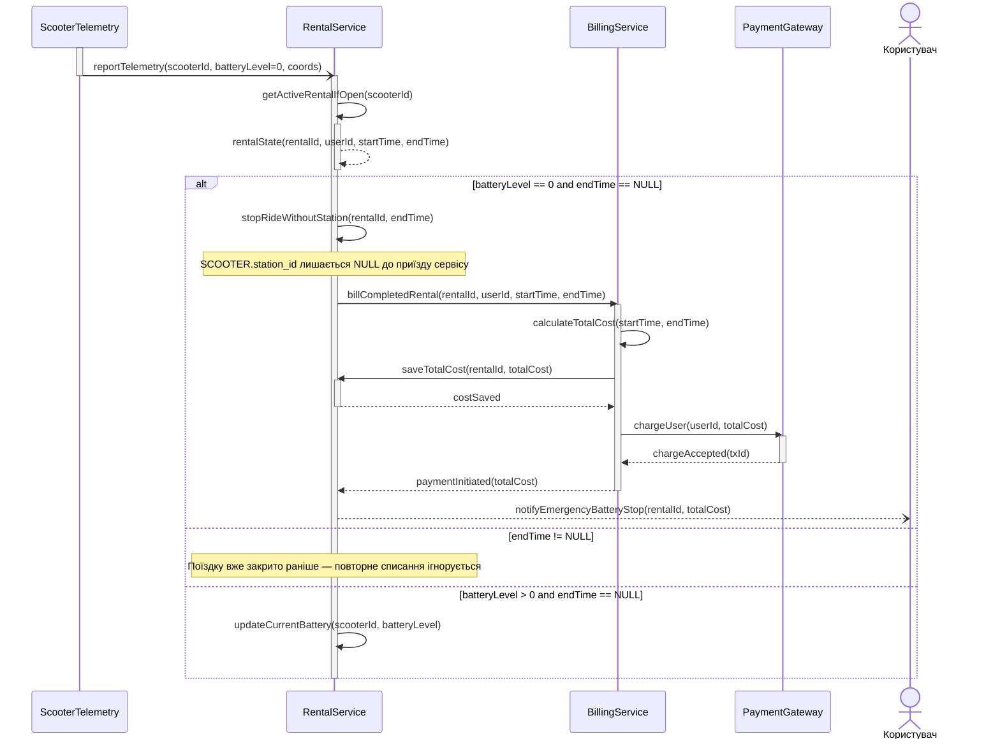

### Діаграма 4 — Зупинка поїздки при критичному розряді батареї

```mermaid
sequenceDiagram
    participant Scooter as ScooterTelemetry
    participant Rental as RentalService
    participant Billing as BillingService
    participant Gateway as PaymentGateway
    actor User as Користувач

    activate Scooter
    Scooter-)Rental: reportTelemetry(scooterId, batteryLevel=0, coords)
    deactivate Scooter

    activate Rental
    Rental->>Rental: getActiveRentalIfOpen(scooterId)
    activate Rental
    Rental-->>Rental: rentalState(rentalId, userId, startTime, endTime)
    deactivate Rental

    alt batteryLevel == 0 and endTime == NULL
        Rental->>Rental: stopRideWithoutStation(rentalId, endTime)
        Note over Rental: SCOOTER.station_id лишається NULL до приїзду сервісу
        Rental->>Billing: billCompletedRental(rentalId, userId, startTime, endTime)
        activate Billing
        Billing->>Billing: calculateTotalCost(startTime, endTime)
        Billing->>Rental: saveTotalCost(rentalId, totalCost)
        activate Rental
        Rental-->>Billing: costSaved
        deactivate Rental
        Billing->>Gateway: chargeUser(userId, totalCost)
        activate Gateway
        Gateway-->>Billing: chargeAccepted(txId)
        deactivate Gateway
        Billing-->>Rental: paymentInitiated(totalCost)
        deactivate Billing
        Rental--)User: notifyEmergencyBatteryStop(rentalId, totalCost)
    else endTime != NULL
        Note over Rental: Поїздку вже закрито раніше — повторне списання ігнорується
    else batteryLevel > 0 and endTime == NULL
        Rental->>Rental: updateCurrentBattery(scooterId, batteryLevel)
    end
    deactivate Rental
```